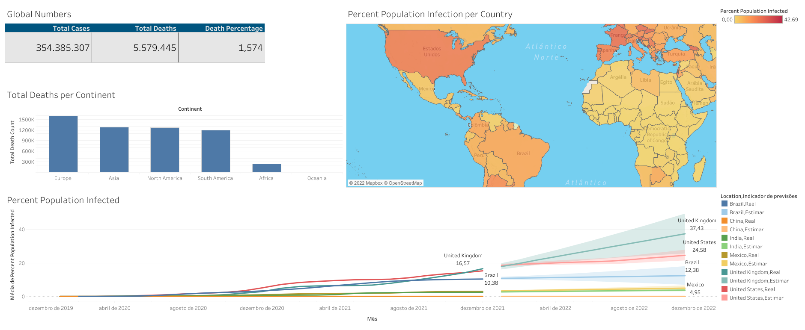

# Data Analysis Projects

<em>These projects are part of a series entitled "[Data Analyst Portfolio Project](https://www.youtube.com/playlist?list=PLUaB-1hjhk8H48Pj32z4GZgGWyylqv85f)" by [Alex, the Analyst](https://www.youtube.com/channel/UC7cs8q-gJRlGwj4A8OmCmXg) where the Alex guides and teaches the process of creating a Data Analysis project to all want learn about it and helping to anyone become a Data Analyst or Data Scientist</em>

1 - Covid Analysis Project with SQL and Tableau

In this project, We used to EDA(Exploratory Data Analysis), the [COVID-19 Deaths OWID Data](https://ourworldindata.org/covid-deaths) about dates of 01-2020 to 01-2022 
using `SQL Server`, specifically the `SQL Server Management Studio` 
and We created a dashboard using `Tableau` based on the data analyzed.

The queries used to make the visualization is: 
1. Total Cases, Total Death and Death Percentage by total cases
2. Total Death by location
3. Highest Infection Count and Percent Population Infected by Location and Population
4. Highest Infection Count and Percent Population Infected by Location, Population and Date

Link to [SQL EDA](https://github.com/brenascimento/PortfolioProjects/blob/main/COVID%20Portfolio%20Project%20Actual%20Scripts%20in%20Video.sql)  
Link to [Visualization](https://public.tableau.com/app/profile/brenno.nascimento.de.oliveira/viz/CovidDashboard2022_16438369581080/Painel1)
